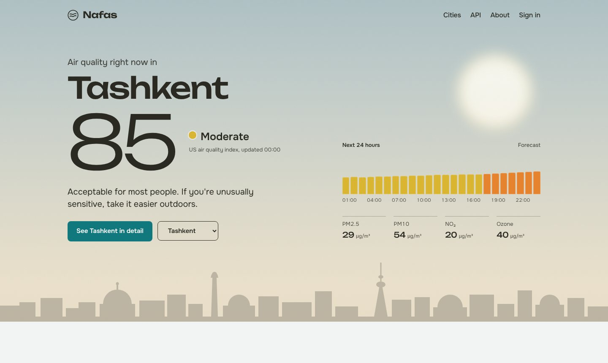
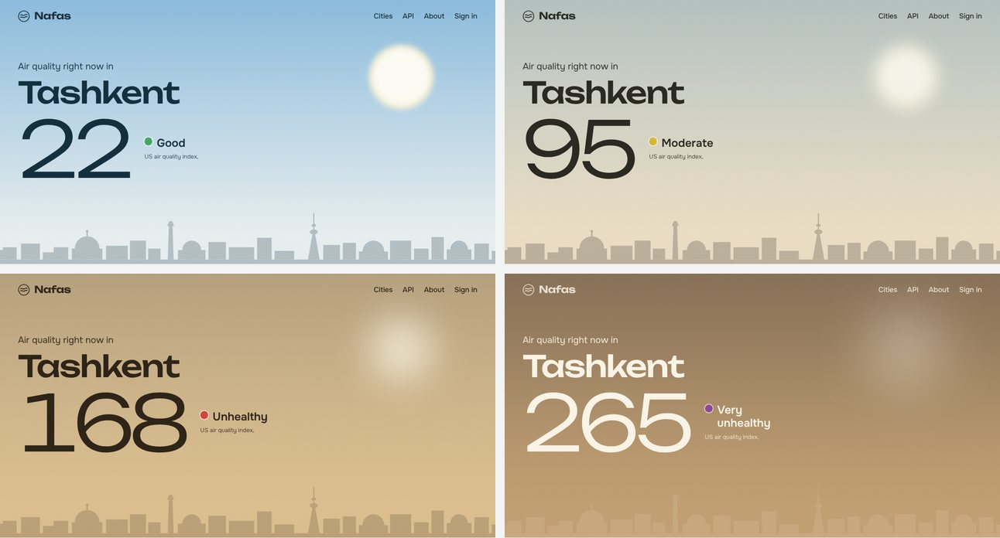
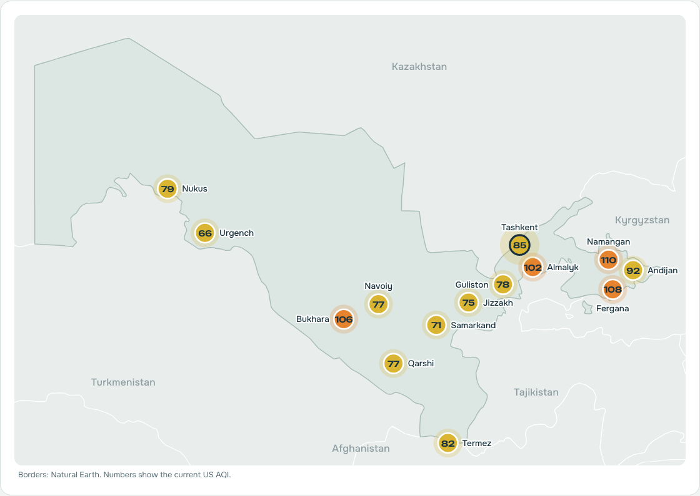
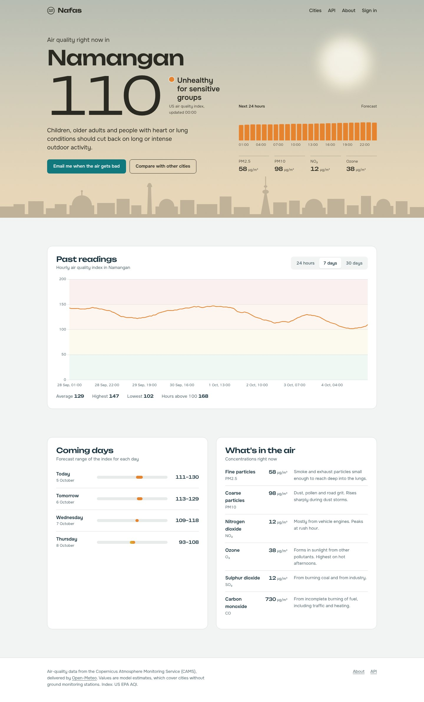
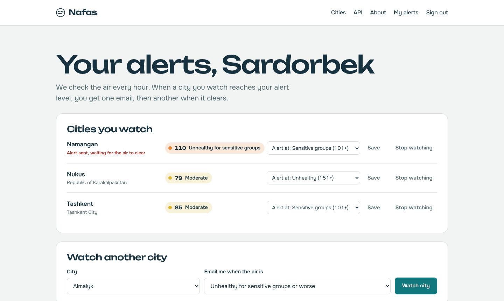
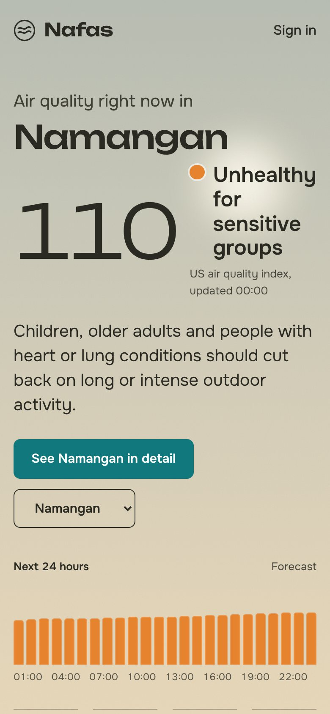

# Nafas: Air Quality Across Uzbekistan

**Nafas** (Uzbek for *breath*) is a full-stack web app that tracks air quality in 14 cities across Uzbekistan, hour by hour. It shows live readings, history and forecasts, and emails users when the air in their cities becomes unhealthy.



## The idea: the sky is the measurement

The hero isn't decoration. Its colours are computed from the air quality index: clear blue when the air is clean, turning to dusty haze as pollution rises. The sun blurs, and the city skyline fades into smog.



Switching cities animates the sky from one state to the other without reloading the page.

## Features

- **Live data** for 14 cities, refreshed every hour from the Copernicus (CAMS) air-quality model via Open-Meteo
- **Hand-drawn SVG map** of Uzbekistan, generated from Natural Earth borders, with no map service or API key needed
- **City pages** with interactive 24-hour, 7-day and 30-day charts, a 4-day forecast, and a pollutant breakdown
- **User accounts** with email alerts at a chosen level (moderate, unhealthy, and so on)
- **Smart alerts**: one email when the air turns bad and one when it clears, never an email every hour
- **Public JSON API** documented at `/developers`
- **Demo mode** with realistic generated data, so the app runs offline
- **38 automated tests**, plus a responsive, accessible design



| City detail | Email alerts |
|---|---|
|  |  |

<p align="center"></p>

## Engineering decisions

**Alerts with hysteresis.** A naive alert checker emails every hour while the air stays bad, and keeps re-alerting when the index wobbles around the threshold. Each subscription here works like a thermostat: the alert opens an *episode*, nothing more is sent while it's open, and the episode only closes once the index drops 10 points below the threshold (`nafas/alerts.py`).

**Idempotent data collection.** Forecasts get revised every hour, so collection is an *upsert* keyed on `(city, hour)`: new hours are inserted and existing ones updated. Re-running it never creates duplicates. The first run backfills a month of history; later runs fetch only the last two days.

**Failure isolation.** Each city is fetched separately with retries and exponential backoff. If one request fails, the other cities still update, and the failure is logged.

**One scheduler, not many.** APScheduler runs inside the web process, which could run every job twice: Flask's development reloader starts two processes, and Gunicorn can start several workers. The scheduler is started only by the entry points (`run.py` for development, `wsgi.py` for production), only in the process that serves requests, and production uses a single worker with threads. CLI commands and tests never start background jobs.

**Security basics.** Passwords are hashed (Werkzeug/PBKDF2). Every form post is CSRF-protected. Login redirects only allow same-site paths, and users can only change their own subscriptions.

**AQI computed correctly.** The US EPA index is implemented with the 2024 PM2.5 breakpoints, including the EPA's truncation rules, and tested at every boundary (`nafas/aqi.py`).

## Project structure

```
nafas/
├── aqi.py          # EPA AQI breakpoints, categories, advice, sky colours
├── collector.py    # Open-Meteo client: fetch, parse, upsert, retries
├── alerts.py       # Alert episodes with hysteresis
├── scheduler.py    # Hourly refresh + alert check (APScheduler)
├── demo.py         # Realistic generated data for demo mode
├── models.py       # City, Reading, User, Subscription, AlertLog
├── queries.py      # Current reading, history, forecast helpers
├── geo.py          # Projected border paths for the SVG map
├── views/          # main pages, auth, alerts dashboard, JSON API
├── templates/
└── static/         # CSS, JS, self-hosted fonts, Chart.js
tests/              # 38 tests: AQI maths, alerts, API, collector, pages
```

## Run it locally

Requires **Python 3.11+**.

```bash
git clone https://github.com/YOUR-USERNAME/nafas.git
cd nafas
python -m venv .venv
source .venv/bin/activate        # Windows: .venv\Scripts\activate
pip install -r requirements.txt
cp .env.example .env             # Windows: copy .env.example .env
python run.py
```

Open http://localhost:5000. On first start, the app downloads a month of history for all 14 cities, which takes about half a minute.

**No internet, or just want to try it?** Set `DEMO_MODE=1` in `.env` to use generated data. A banner on the site makes clear it isn't real.

**Email alerts:** without `MAIL_SERVER`, alert emails are printed to the terminal, which is handy for testing. To send real emails, fill in the `MAIL_*` settings. With Gmail, use an [app password](https://support.google.com/accounts/answer/185833), not your normal password.

Useful commands:

```bash
flask --app run collect        # fetch fresh data now
flask --app run check-alerts   # send any due alerts now
python -m pytest               # run the tests
```

## Deploy

The app runs on any host that supports Python, such as Render, Railway or Fly.io. The `Procfile` starts Gunicorn with one worker.

1. Push the repo to GitHub and create a new **web service** from it.
2. Build command: `pip install -r requirements.txt`. Start command: the one in `Procfile`.
3. Set the environment variables `SECRET_KEY` (a long random string) and `SITE_URL` (your app's address).
4. Add a **PostgreSQL** database and set `DATABASE_URL` to its connection string. Many hosts wipe local files on each deploy, so SQLite would lose your users.

Free tiers vary by provider and change over time, so check current limits. Some free services sleep when idle, which also pauses the hourly refresh.

## API

| Endpoint | Returns |
|---|---|
| `GET /api/v1/cities` | All cities with current readings |
| `GET /api/v1/cities/<slug>` | One city's current reading |
| `GET /api/v1/cities/<slug>/history?hours=24` | Hourly history (up to 31 days) |
| `GET /api/v1/cities/<slug>/forecast` | Hourly forecast and daily summary |

## Data and credits

- Air-quality data: [Copernicus Atmosphere Monitoring Service](https://atmosphere.copernicus.eu/) via the [Open-Meteo Air Quality API](https://open-meteo.com/en/docs/air-quality-api). Free for non-commercial use; values are model estimates, not station measurements.
- Borders: [Natural Earth](https://www.naturalearthdata.com/) (public domain), via `world-atlas`.
- Fonts: Unbounded and Onest, SIL Open Font License (`nafas/static/fonts/OFL-LICENSE.txt`).
- Charts: [Chart.js](https://www.chartjs.org/) (MIT).

Screenshots show demo-mode data.
